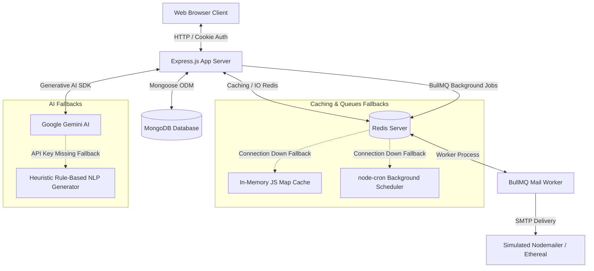

# Smart Task Manager — SaaS Team Collaboration Workspace

An enterprise-grade, modern SaaS team task management web application built with **Node.js, Express, MongoDB, Redis, and Google Gemini AI**. The application features robust security, user authentication, a beautiful dark-themed responsive dashboard, real-time caching, background task runners, and intelligent AI assistance with graceful in-memory fallbacks.

---

## 🏗️ System Architecture



---

## ✨ Features Checklist & Milestones

Here is a summary of the capabilities implemented across the development roadmap:

- [x] **Task 1: Basic Web Server & EJS Rendering**
  - Setup Express application server and EJS views engine.
  - Form integration that triggers synchronous POST requests rendering task summaries (`showTask.ejs`).
- [x] **Task 2: Task Storage & Listing**
  - In-memory workspace task array storage (`tempTasks`) for development.
  - Multi-priority categorization (Low, Medium, High).
- [x] **Task 3: Modern Dark-Theme Workspace UI**
  - Implemented sleek, premium dark-mode interface styled with Tailwind CSS, Google Fonts, and FontAwesome icons.
  - Sidebar with dynamic workspace statistics and interactive counters.
- [x] **Task 4: Interactive Client AJAX Operations**
  - Fully decoupled front-to-back communications. Task creation, edit popups, and updates use AJAX (`fetch`) for seamless, no-refresh UI changes.
  - Dynamic client-side character counters for input fields (Title & Description) to prevent payload bloat.
- [x] **Task 5: Instant Search & Multi-Filters**
  - Client-side search and filtration by Priority (All, Low, Medium, High) and Status (All, Pending, Completed).
  - Fade-out and scale-down transition animations for list deletions.
- [x] **Task 6: User Authentication & Security**
  - Secure signup, login, and signout flows.
  - Password hashing with `bcryptjs`.
  - Secure JWT session storage inside HTTP-only cookies.
  - Security headers integration using `helmet` (customized Content Security Policy for CDNs) and `cors`.
  - Request rate limiting (`express-rate-limit`) on API/AI routes.
  - Robust server-side request body sanitization/validation (`express-validator`).
- [x] **Task 7: Google Gemini AI Workspace Assistant**
  - Automated task description outline generation from simple titles.
  - Heuristic-based/AI task priority suggestion.
  - Intelligent dashboard statistics summaries and encouragement text.
  - **Zero-Dependency Fallback**: Seamless, local fallback generators that trigger if the Gemini API Key is missing.
- [x] **Task 8: Production Caching & Background Queues**
  - **Redis Cache Layer**: Read-through/write-invalidate caching of task listings to reduce database queries. Falls back to in-memory `Map` cache if Redis goes offline.
  - **BullMQ Background Workers**: Distributed queuing system for processing transactional mail tasks.
  - **Mail Delivery Scheduler**: Scheduled cron-jobs using `node-cron` for sending due-today hourly reminders, daily workspace highlights, and weekly summaries. Falls back to in-memory crons if Redis is down.
  - Automated email testing using `nodemailer` and `ethereal.email` sandboxes.

---

## 📂 Project Directory Structure

```text
cognifyz/
├── public/                 # Static Assets
│   ├── css/
│   │   └── custom.css      # Custom animations & glassmorphic styles
│   └── js/
│       ├── auth.js         # Authentication page handlers (AJAX)
│       └── dashboard.js    # Core client-side task manager operations
├── src/
│   ├── config/
│   │   ├── db.js           # MongoDB / Mongoose connection handler
│   │   └── redis.js        # Redis connection with auto-fallback configuration
│   ├── controllers/
│   │   ├── aiController.js # AI Service routes controller
│   │   ├── apiController.js# Task REST API controllers
│   │   ├── authController.js# Registration/Login/Logout handlers
│   │   └── taskController.js# Traditional EJS POST controllers
│   ├── middleware/
│   │   ├── authMiddleware.js# JWT Cookie verification guard
│   │   ├── rateLimiter.js  # API request throttler
│   │   └── validator.js    # express-validator schemes
│   ├── models/
│   │   ├── Task.js         # MongoDB Schema for tasks
│   │   └── User.js         # MongoDB Schema for users
│   ├── routes/
│   │   ├── aiRoutes.js     # AI endpoints
│   │   ├── apiRoutes.js    # Tasks API endpoints
│   │   ├── authRoutes.js   # Auth endpoints
│   │   └── viewRoutes.js   # EJS template view routing
│   ├── services/
│   │   ├── aiService.js    # Gemini / Simulator AI processing
│   │   ├── cacheService.js # Cache management (Redis / Map)
│   │   └── queueService.js # Background cron & BullMQ workers
│   ├── views/              # EJS Templates
│   │   ├── layouts/
│   │   │   └── main.ejs    # Parent wrapper template
│   │   ├── partials/
│   │   │   ├── footer.ejs  # Footer partial
│   │   │   ├── header.ejs  # Styles/Fonts layout configuration
│   │   │   ├── navbar.ejs  # Logged-in header banner
│   │   │   └── sidebar.ejs # Workspace statistics & profile panel
│   │   ├── dashboard.ejs   # Core dashboard view
│   │   ├── login.ejs       # Auth login view
│   │   ├── register.ejs    # Auth signup view
│   │   └── showTask.ejs    # Single task display page
│   ├── app.js              # Express app initialization & security configuration
│   └── server.js           # Server runner (Database connection, Redis startup, queues)
├── .env                    # System Environment Variables
├── package.json            # Node configuration and dependencies
└── README.md               # Documentation (This file)
```

---

## 🛠️ Environment Variables Configuration

Create a `.env` file in the root folder. You can configure the variables as follows:

```env
# Server Port Configuration
PORT=3000

# Databases
MONGO_URI=mongodb://127.0.0.1:27017/smart_task_manager
REDIS_URL=redis://127.0.0.1:6379

# JWT Security
JWT_SECRET=your_jwt_signing_key_here

# AI Service (Optional - Will default to simulator if empty)
GEMINI_API_KEY=

# Ethereal Email Credentials (For background reminders)
EMAIL_USER=test@example.com
EMAIL_PASS=testpass
```

---

## 🚀 Getting Started

### 📋 Prerequisites
Ensure you have the following installed locally:
- [Node.js](https://nodejs.org/) (Version >= 18.0.0)
- [MongoDB](https://www.mongodb.com/) (Running locally or hosted)
- [Redis Server](https://redis.io/) (Optional, but recommended for production caching & background queues)

### 📥 Installation Steps

1. **Navigate to the cognifyz workspace directory**:
   ```bash
   cd cognifyz
   ```

2. **Install Node Dependencies**:
   ```bash
   npm install
   ```

3. **Database and Cache Servers Setup**:
   Ensure MongoDB and Redis services are running on your system:
   ```bash
   # Start MongoDB (Linux systemd example)
   sudo systemctl start mongod

   # Start Redis server (Linux systemd example)
   sudo systemctl start redis-server
   ```

4. **Run Application**:
   * **Development Mode (with Nodemon auto-reload)**:
     ```bash
     npm run dev
     ```
   * **Production Start**:
     ```bash
     npm start
     ```

5. **Access Workspace**:
   Open [http://127.0.0.1:3000](http://127.0.0.1:3000) in your web browser.

---

## 🔌 API Documentation

### 🔐 Authentication Routes

| Method | Endpoint | Description | Auth Required |
|---|---|---|---|
| `POST` | `/auth/register` | Register a new user | No |
| `POST` | `/auth/login` | Authenticate and issue JWT cookie | No |
| `GET` | `/auth/logout` | Clear token cookie and log user out | Yes |

---

### 📝 Tasks REST API (`/api/tasks`)

*All API routes require authentication.*

#### 1. Retrieve User Tasks
* **Endpoint**: `GET /api/tasks`
* **Response (200 OK)**:
  ```json
  [
    {
      "_id": "64bfd4e...",
      "title": "Build API Endpoints",
      "description": "Create task CRUD routes.",
      "priority": "High",
      "completed": false,
      "dueDate": "2026-06-30T00:00:00.000Z",
      "user": "64bfd49...",
      "createdAt": "2026-06-26T21:58:31.000Z"
    }
  ]
  ```
  *(Note: Served instantly from Redis Cache if requested within the 60s TTL window).*

#### 2. Create Task
* **Endpoint**: `POST /api/tasks`
* **Body Parameters**:
  ```json
  {
    "title": "Verify Queue Workers",
    "description": "Make sure BullMQ handles mail delivery correctly.",
    "priority": "Medium",
    "dueDate": "2026-07-02"
  }
  ```

#### 3. Update Task
* **Endpoint**: `PUT /api/tasks/:id`
* **Body Parameters (All Optional)**: `title`, `description`, `priority`, `completed`, `dueDate`.

#### 4. Delete Task
* **Endpoint**: `DELETE /api/tasks/:id`

---

### 🤖 AI Service Endpoints (`/api/ai`)

*All AI routes require authentication.*

#### 1. Generate Task Description Outline
* **Endpoint**: `POST /api/ai/description`
* **Body Parameters**:
  ```json
  { "title": "Configure SSL Certificates" }
  ```
* **Response**:
  ```json
  {
    "description": "### Task Overview\nThis task is created to address: 'Configure SSL Certificates'...\n..."
  }
  ```

#### 2. Suggest Task Priority
* **Endpoint**: `POST /api/ai/priority`
* **Body Parameters**:
  ```json
  {
    "title": "Fix memory leak in web sockets",
    "description": "The socket process crashes every 4 hours under heavy load."
  }
  ```
* **Response**:
  ```json
  { "priority": "High" }
  ```

#### 3. Workspace Tasks Summary
* **Endpoint**: `GET /api/ai/summary`
* **Response**: Returns a motivational or actionable progress summary block (generated dynamically using Gemini/Local Simulators).
